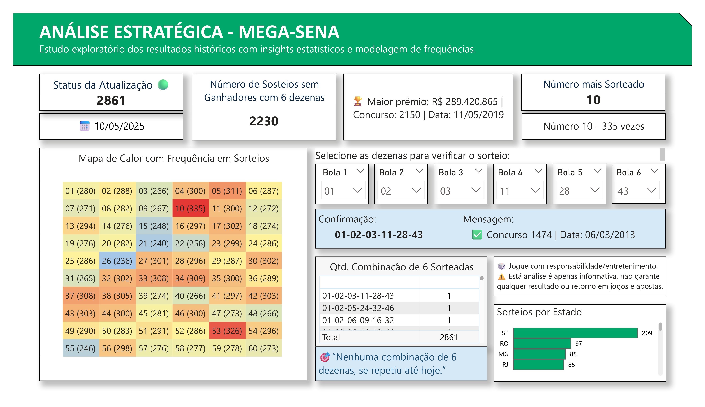

# 🎯 Dashboard de Análise da Mega-Sena com Power BI

Estudo, manipulação, análise de dados, aplicação de ferramentas em um tema de interesse em nível nacional. 
Este projeto é um painel interativo criado no Power BI para explorar os resultados da Mega-Sena.
Utilizei dados públicos da Caixa Econômica Federal, permitindo ao usuário analisar diferentes concursos, histórico de sorteios, padrões estatísticos e obter insights relevantes.
---

# 📊 Funcionalidades do Dashboard

- 🔢 **Mapa de calor das dezenas mais sorteadas**
- 📅 **Informações de atualização e maior prêmio já sorteado**
- 🔍 **Número de sorteios sem ganhadores**
- 💻 **Sorteio por estado**
- 🎛️ **Quantidade de combinações de 6 dezenas sorteadas e quantas vezes ela se repetiu**
- 🎯 **Verificação personalizada de combinações**: permite ao usuário inserir 6 dezenas e verificar se essa combinação já foi sorteada — com data e número do concurso.
---

# 🛠️ Ferramentas utilizadas

- **Power BI Desktop**
- **Power Query** para ETL
- **DAX** para medidas analíticas (como verificação de combinação do usuário)
- **Fonte de dados**: Resultados oficiais da Mega-Sena (site da Caixa)
---

# 📁 Estrutura dos arquivos

| Arquivo | Descrição |
|---------|-----------|
| `202504_PRTF_Mega_R01.pbix` | Arquivo principal do Power BI |
| `d_megase.csv` | Base de dados com todos os resultados históricos |
| `README.md` | Descrição do projeto |
---

# 🧠 Principais insights

- Dezenas mais sorteadas historicamente e sua frequência com o decorrer das atualizações. 
- Número de sorteios *sem* ganhadores, ilustrando a proporção inversa a quantidade de sorteios.
- Combinação de 6 dezenas sorteadas em relação a sua repetição, indicando um fator de aleatoriedade superficial.
- Concentração de premiação por estado.
- Escolha das dezenas de um concurso, na verificação do concurso e data do sorteio.
- Para cada aposta de 6 dezenas a chance é de 1 para 50.063.860.
---

# 🖼️ Imagens do Dashboard

---

# 📌 Autor

(https://www.linkedin.com/in/suami-yonashiro)
---

# 📥 Como baixar e usar

1. Faça o download do arquivo `.pbix` e .csv
2. Abra no Power BI Desktop
3. Clique em “Atualizar” para carregar os dados mais recentes
---

# 📜 Licença

Este projeto utiliza dados públicos e está disponível para fins educacionais.
